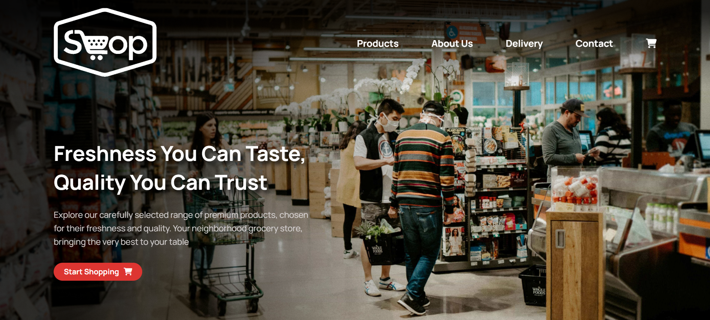
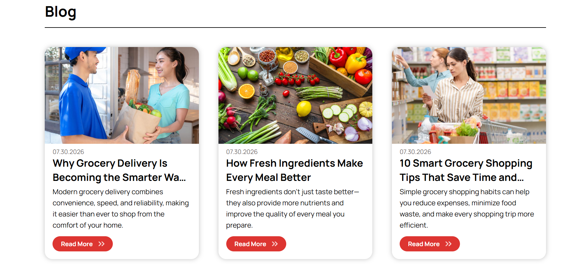
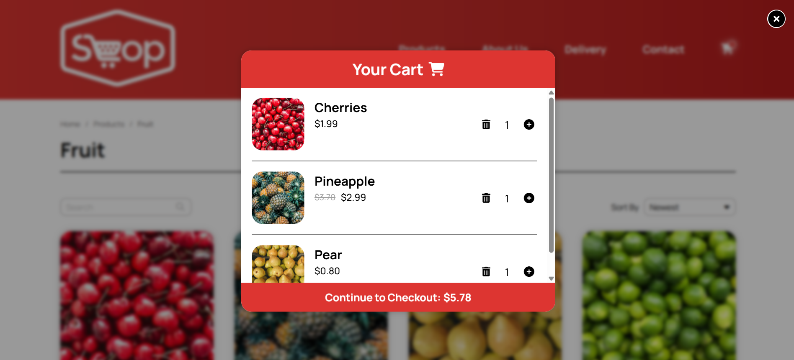
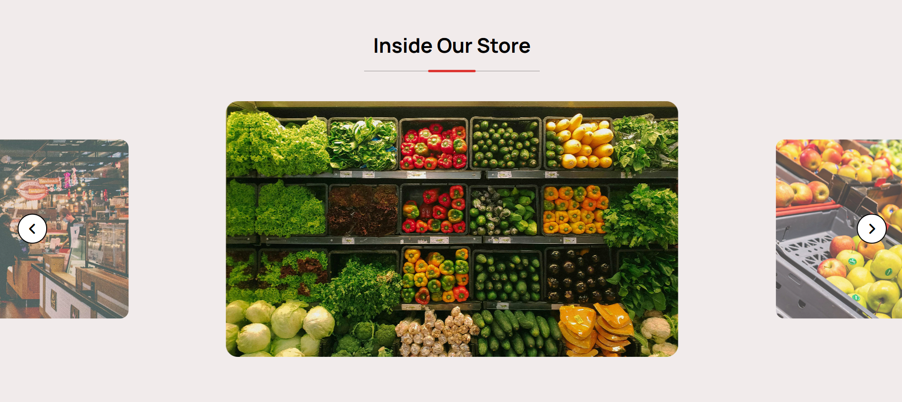
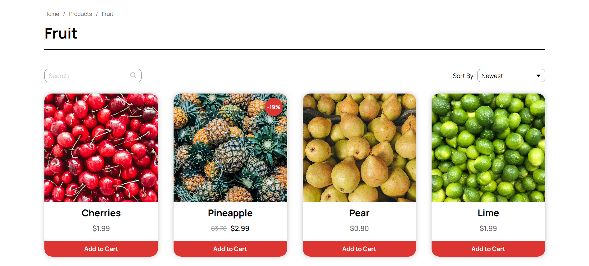
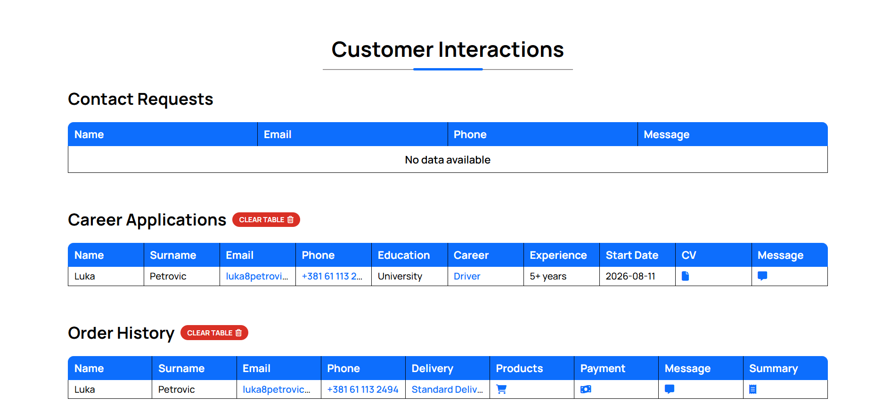
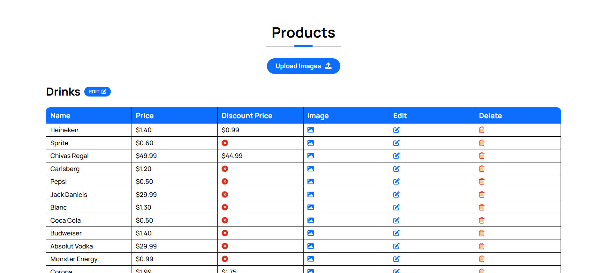
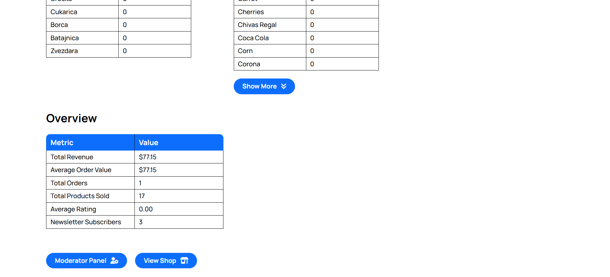

# WebShop

A fully responsive webshop built entirely from scratch using HTML, CSS, JavaScript, PHP, and MySQL. The project includes a modern customer-facing website and a dedicated admin dashboard that enables administrators to manage products, categories, orders, blogs and other website content through an intuitive interface.

## Overview

This project is a full-stack grocery webshop that I designed and developed entirely from scratch using HTML, CSS, JavaScript, PHP, and MySQL. What began as a small testing project to experiment with web development gradually evolved into a much larger and more comprehensive application. As I continued learning and gaining experience, I expanded the project by adding new functionality, improving the user interface, and implementing features commonly found in modern e-commerce websites.

The application consists of two main parts: a customer-facing website and a dedicated administration dashboard. Every aspect of the project, including the user interface, database structure, backend logic, responsive design, and the majority of the functionality, was built by me without using frontend or backend frameworks.

The customer-facing website provides a complete shopping experience, allowing users to browse products, search for specific items, filter and sort products, add products to the shopping cart, and complete the checkout process through a multi-step order form. Additional features include a blog, gallery, newsletter subscription, contact form, product reviews and ratings, and career applications with CV uploads. Throughout the application, both client-side and server-side validation are used to improve data integrity and provide a smooth user experience.

The administration dashboard allows administrators to manage nearly every aspect of the website through a centralized interface. Products, categories, orders, blogs, reviews, newsletter subscriptions, career applications, and customer messages can all be viewed and managed without directly interacting with the database. The dashboard also includes statistical information that provides insights into customer activity, product popularity, category performance, and other useful metrics.

Throughout development, I placed a strong emphasis on writing clean, maintainable code, creating reusable components, and designing a consistent, responsive user interface that works across desktop, tablet, and mobile devices. The project incorporates modern web development techniques such as AJAX requests, dynamic filtering and sorting, interactive animations, and comprehensive client-side and server-side validation to create a realistic e-commerce experience.

This project was created primarily as a portfolio project and learning experience rather than a production-ready commercial application. As a result, certain production-level features and security measures that would be expected in a publicly deployed webshop have intentionally not been implemented. The focus was on demonstrating practical full-stack development skills, application architecture, database design, and the implementation of real-world functionality.

Development of the project began before AI-assisted programming tools became widely available. The initial architecture, design, and implementation were completed independently. As AI tools matured, I incorporated them into my workflow primarily as a development assistant for debugging, discussing implementation approaches, and solving more complex technical challenges. The overall design, application structure, and the majority of the code was planned, written, and integrated by me.

## Features

### Shopping Experience
- Browse products by category
- Search products by name
- Filter products using multiple criteria
- Sort products by popularity, price, discount, and newest
- Display discounted products and savings
- Responsive product grid

### Shopping Cart & Checkout
- Add and remove products from the shopping cart
- Update product quantities
- Real-time cart total calculation
- Multi-step checkout process
- Multiple delivery options
- Borough-based delivery pricing
- Card and cash payment options
- Comprehensive client-side and server-side validation

### User Interaction
- Contact form
- Newsletter subscription
- Reviews and ratings
- Career application form with CV upload
- Blog section
- Gallery
- Frequently Asked Questions (FAQ)

### User Experience
- Fully responsive design
- Interactive animations
- AJAX-powered forms
- Loading indicators
- Success and error notifications
- Form validation with clear error messages
- Smooth scrolling and transitions
- Mobile-friendly navigation

### Order Management
- View customer orders
- View complete order details
- Track purchased products
- View payment methods
- View delivery information

### Product Management
- Add new products
- Edit existing products
- Delete products
- Manage product images
- Manage discounts
- Update product prices
- Track product popularity

### Category Management
- Create categories
- Edit category names
- Delete categories
- Display category statistics

### Blog Management
- Create blog posts
- Edit blog posts
- Delete blog posts
- Rich text editor (TinyMCE)
- Image management

### Customer Content Management
- Review customer reviews
- Manage newsletter subscriptions
- Review career applications
- Download uploaded CVs
- View customer contact messages

### Statistics
- Customer statistics
- Product statistics
- Category statistics
- Order statistics
- Most popular products
- Customer spending overview

### Data Management
- Reset selected tables
- Clear table data
- Dynamic admin tables

### Front-End
- Semantic HTML5 structure
- Responsive CSS layout
- CSS animations
- JavaScript DOM manipulation
- Dynamic filtering and sorting
- Modular code organization

### Back-End
- PHP
- MySQL database integration
- Session management
- CRUD operations
- File uploads
- AJAX communication
- Server-side validation
- Dynamic content rendering

### Security & Validation
- Client and server side validation
- Prepared SQL statements
- Input sanitization
- File type and size validation
- Session-based administrator authentication

## Technologies

The project was developed using core web technologies without relying on frontend or backend frameworks. Additional third-party libraries were integrated only where they provided meaningful functionality or improved the user experience.

### Front-End
- HTML5
- CSS3
- JavaScript

### Back-End
- PHP

### Database
- MySQL

### Development Tools
- XAMPP
- phpMyAdmin
- Visual Studio Code

### Libraries & APIs
- TinyMCE (Rich Text Editor)
- Font Awesome
- AOS (Animate On Scroll)
- intl-tel-input

## Installation

Follow these steps to run the project locally:

### Prerequisites
- XAMPP (Apache & MySQL)
- Modern web browser

### Setup
- Clone or download this repository.
- Move the project folder into the `htdocs` directory inside your XAMPP installation.
- Start **Apache** and **MySQL** using the XAMPP Control Panel.
- Open **phpMyAdmin** and create a new database.
- Import `shop_database.sql` from the `database` folder.
- Update the database connection settings in `includes/dbconnection.php` if necessary.
- Open your browser and navigate to: http://localhost/GroceryWebShop/

The application should now be running locally.

## Admin Credentials

### Admin
- **Username:** shopAdmin
- **Password:** Admin_Shop1

### Moderator
- **Username:** shopModerator
- **Password:** Moderator_Shop2

## Challenges & Solutions

Developing this project presented a variety of technical challenges that allowed me to strengthen my problem-solving skills and gain practical experience in full-stack web development.

### Building a Complete Administration Dashboard
One of the biggest challenges was designing an administration panel capable of managing multiple sections of the website through a single interface. This required creating reusable CRUD operations, dynamic tables, modal windows, and ensuring that changes made by administrators were immediately reflected throughout the application.

### Form Validation
Implementing comprehensive validation across multiple forms required careful planning. Each form combines client-side JavaScript validation with server-side PHP validation to improve usability while ensuring data integrity and security.

### Dynamic Shopping Experience
Creating a responsive shopping experience involved implementing product searching, filtering, sorting, shopping cart management, and a multi-step checkout process while keeping the interface intuitive and responsive.

### Database Design
Designing the database structure required organizing relationships between products, categories, orders, customers, reviews, blogs, newsletter subscriptions, and career applications. The goal was to keep the database scalable, maintainable, and efficient for future expansion.

### Responsive Design
Ensuring a consistent experience across desktop, tablet, and mobile devices required continuous testing and refinement. Many components, including navigation menus, product layouts, forms, galleries, and the administration dashboard, were redesigned multiple times to provide an optimal experience on different screen sizes.

### User Experience
Throughout development, significant attention was given to creating an intuitive user interface through interactive animations, loading indicators, clear validation messages, responsive layouts, and consistent visual design to improve the overall user experience.

### Continuous Improvement
Since this project evolved over an extended period of time, many parts of the application were redesigned and refactored as my knowledge and experience grew. Features were continuously improved, code was reorganized, and new functionality was added to create a more complete and maintainable application.

## Screenshots

### Homepage

### Blog

### Shopping Cart

### Gallery

### Products

### Admin

### Moderator

### Statistics

## Demo Videos

The application consists of two main parts:

- **Customer Website Demo** - Shows browsing, filtering, cart management, checkout, blog, gallery.
- **Admin Dashboard Demo** - Demonstrates product management, category management, blog management, order management, statistics, and other administrative features.

The demo videos are available in the repository's **Releases** section.

## Future Improvements
- Implement user authentication and personal customer accounts.
- Integrate a secure online payment gateway such as Stripe or PayPal.
- Add advanced product filtering.
- Improve security.
- Develop an order tracking system for customers.
- Add email notifications for order confirmations and status updates.
- Expand the admin dashboard with sales analytics and reporting.
- Deploy the application to a production hosting environment.

## Author

Developed by **Luka Petrovic**

Thank you for taking the time to explore this project. I hope it provides a clear demonstration of my approach to full-stack web development, problem-solving, and building practical, user-focused applications from the ground up. If you have any questions, feedback, or opportunities to discuss, feel free to get in touch.

### Contact
- Phone: +381 61 113 2494
- Email: luka8petrovic8@google.com
- GitHub: https://github.com/LukaPetrovic8